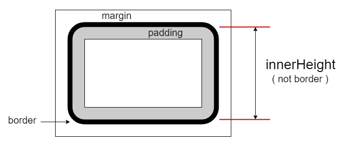

# $.innerHeight( el ): Number

获取 `el` 元素的内部高度（包含 `padding` 部分但不包含 `border` 部分）。该接口不包含设置目标高度的功能，如果需要请使用 `$.height` 接口（减去 `padding` 部分）。

内部高度图示：




## 参数

### el: Element

取值的目标元素。**注**：不应当用于文档（`document`）或窗口（`window`），如果需要请使用 `.height` 接口。


## 示例

```html
<section id="s0" style="padding: 10px; height: 120px; border: 5px #ccc solid;">
    <p>首个段落。</p>
    <p id="p2">第二个段落。</p>
    <p id="p3">The third paragraph.</p>
</section>
```


### 单元素版

```js
let sel = $.get('#s0');

$.innerHeight(sel)
// 140
// 注：包含上下padding，但不包含border。

$.height(sel)
// 120


// 模拟 $.innerHeight(el, val) 设置功能。
// 设置 innerHeight 为200像素。
$.height(sel, h => 200 - ($.innerHeight(sel) - h) );

$.innerHeight(sel);
// 200

$.height(sel);
// 180
```


### 集合版

```js
let ps = $('#s0 p');

ps.innerHeight();
// [20.6667, 20.6667, 20.6667]


ps.css('padding', 10);
ps.innerHeight();
// [40.6667, 40.6667, 40.6667]


ps.css('padding', [null]);
// 删除了首个<p>元素的padding样式。

ps.innerHeight();
// [20.6667, 40.6667, 40.6667]


ps.css('padding', null);
// 删除了全部<p>元素的padding样式。

ps.innerHeight();
// [20.6667, 20.6667, 20.6667]
```
