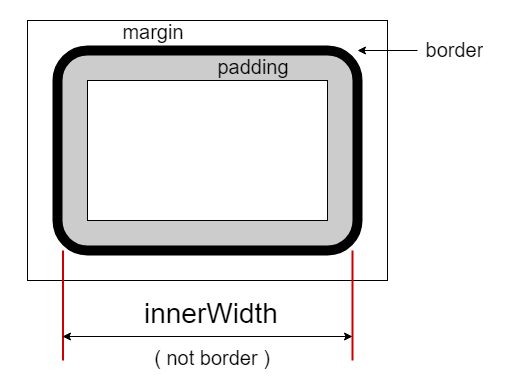

# $.innerWidth( el ): Number

获取 `el` 元素的内部宽度（包含 `padding` 部分但不包含 `border` 部分）。该接口不包含设置目标宽度的功能，如果需要请使用 `$.width` 接口（减去 `padding` 部分）。

内部宽度图示：




## 参数

### el: Element

取值的目标元素。**注**：不应当用于文档（`document`）或窗口（`window`），如果需要请使用 `.width` 接口。


## 示例

```html
<section id="s0" style="padding: 10px; border: 5px #ccc solid; width: 800px;">
    <p>首个段落。</p>
    <p id="p2">第二个段落。</p>
    <p id="p3">The third paragraph.</p>
</section>
```


### 单元素版

```js
let sel = $.get('#s0');

$.innerWidth(sel)
// 820
// 注：包含左右padding，但不包含border。

$.width(sel)
// 800


// 模拟 $.innerWidth(el, val) 设置功能。
// 设置 innerWidth 为900像素。
$.width(sel, w => 900 - ($.innerWidth(sel) - w) );

// 或者，
// 用宽度增量即可。
$.width( sel, () => 900-$.innerWidth(sel), true );


$.innerWidth(sel);
// 900

$.width(sel);
// 880
```


### 集合版

```js
let ps = $('#s0 p');

ps.innerWidth();
// [800, 800, 800]
// 注：为继承上层容器的宽度。


ps.css('padding', 10);
ps.width();
// [780, 780, 780]
// 注：
// 段落本身没有宽度定义，因此实际上是被padding压缩了。

ps.innerWidth();
// [800, 800, 800]
// 由上层容器宽度限定，与.width关系依然正确。


ps.css('border', '5px #999 solid');
ps.innerWidth();
// [790, 790, 790]
// 注：被border宽度压缩（左右）。

ps.width();
// [770, 770, 770]
// 注：容器宽度除去border和padding两部分。
```

> **注记：**<br>
> 与高度 `.innerHeight` 示例不同，没有设置高度样式的段落的实际高度受限于文字本身，不可被压缩。而没有设置宽度样式的段落内，文字是可以换行的，因此会被padding压缩。
