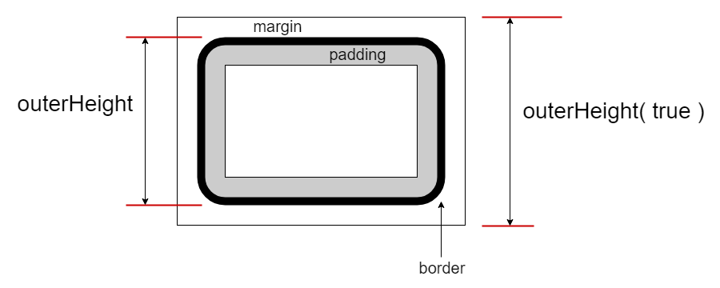

# $.outerHeight( el, margin? ): Number

获取 `el` 元素的外围高度（包含 `border` 部分，可选的包含 `margin` 部分）。该接口不包含设置目标高度的功能，如果需要请使用 `$.height` 接口。

外围高度图示：




## 参数

### el: Element

取值的目标元素。**注**：不应当用于文档（`document`）或窗口（`window`），如果需要请使用 `.height` 接口。


## 示例

```html
<section id="s0" style="padding: 10px; height: 120px; border: 5px #ccc solid; margin: 10px;">
    <p>首个段落。</p>
    <p id="p2">第二个段落。</p>
    <p id="p3">The third paragraph.</p>
</section>
```


### 单元素版

```js
let sel = $.get('#s0');

$.outerHeight(sel)
// 150
// 注：包含上下padding和border。

$.height(sel)
// 120


// 模拟 $.outerHeight(el, val) 设置功能。
// 设置 outerHeight 为240像素（不含margin）。
$.height(sel, h => 240 - ($.outerHeight(sel) - h) );

$.outerHeight(sel);
// 240

$.height(sel);
// 210


// 设置 outerHeight 为240像素（包含margin）。
$.height(sel, h => 240 - ($.outerHeight(sel, true) - h) );

$.outerHeight(sel, true);
// 240

$.outerHeight(sel);
// 220

$.height(sel);
// 190
```


### 集合版

```js
let els = $('#s0');

els.height();
// [120]

els.outerHeight();
// [150]
// 注：上下各10px的padding，5px的border。

els.outerHeight(true)
// [170]
// 注：上下各10px的margin。


let ps = $('#s0 p');

ps.outerHeight();
// [20.6667, 20.6667, 20.6667]

ps.outerHeight(true)
// [52.6667, 52.6667, 52.6667]
// 注：段落默认拥有上下16px的margin值。
```
