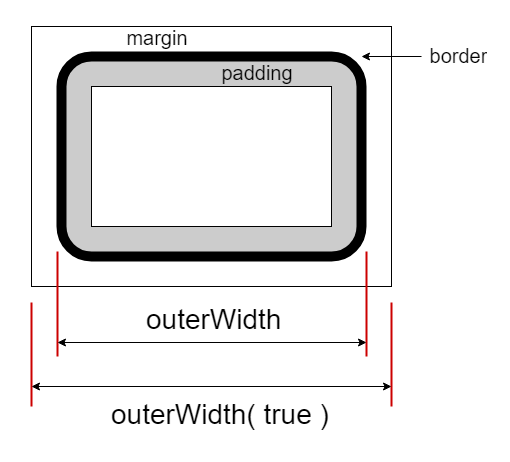

# $.outerWidth( el, margin? ): Number

获取 `el` 元素的外围宽度（包含 `border` 部分，可选的包含 `margin` 部分）。该接口不包含设置目标宽度的功能，如果需要请使用 `$.width` 接口。

外围宽度图示：




## 参数

### el: Element

取值的目标元素。**注**：不应当用于文档（`document`）或窗口（`window`），如果需要请使用 `.width` 接口。


## 示例

```html
<section id="s0" style="padding: 10px; width: 800px; border: 5px #ccc solid; margin: 10px;">
    <p>首个段落。</p>
    <p id="p2">第二个段落。</p>
    <p id="p3">The third paragraph.</p>
</section>
```


### 单元素版

```js
let sel = $.get('#s0');

$.width(sel)
// 800

$.outerWidth(sel)
// 830
// 注：包含左右padding和border。


// 模拟 $.outerWidth(el, val) 设置功能。
// 设置 outerWidth 为800像素（不含margin）。
$.width(sel, w => 800 - ($.outerWidth(sel) - w) );

$.outerWidth(sel);
// 800

$.width(sel);
// 770
// 注：出去20px的padding和10px的border。


// 设置 outerWidth 为800像素（包含margin）。
$.width(sel, w => 800 - ($.outerWidth(sel, true) - w) );

$.outerWidth(sel, true);
// 800

$.outerWidth(sel);
// 780

$.width(sel);
// 750
```


### 集合版

```js
let els = $('#s0');

els.width();
// [800]

els.outerWidth();
// [830]
// 注：左右各10px的padding，5px的border。

els.outerWidth(true)
// [850]
// 注：左右各10px的margin。
```
